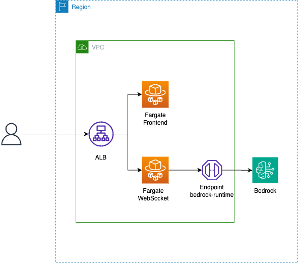

# Bedrock Stream 内部通信サンプル

## 概要

Bedrockを閉域網で利用することを目的としたサンプルです。
入り口であるALBはパブリックサブネットに配置し、インターネットから接続する形になっていますが、ALBを内部にしてDirectConnectで繋がった社内ネットワークなどから接続することも可能な想定です。

サンプルのため、チャットの情報は保存していません。

## 構成

## 構築

AWS CDKを利用して構築しているため、事前にCDKの初期化が必要です。

https://docs.aws.amazon.com/ja_jp/cdk/v2/guide/bootstrapping.html

- `cd infra`
- `cdk deploy`